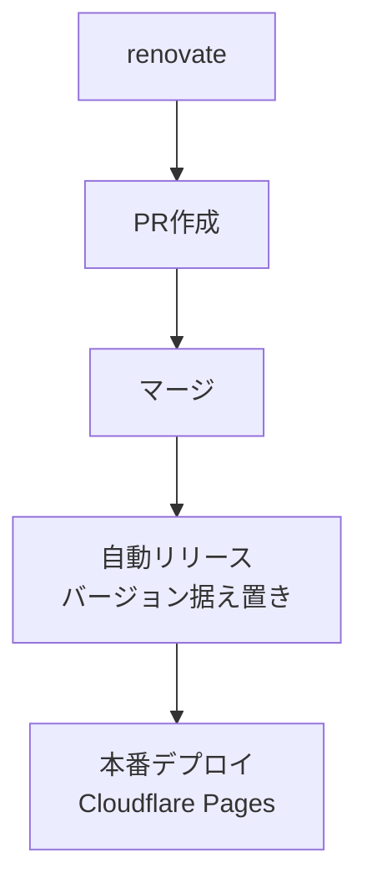
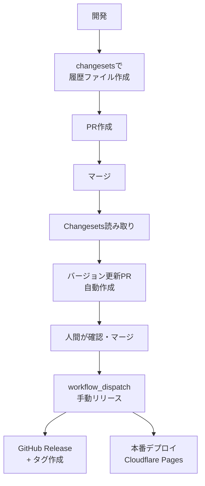

## 自動化と人的制御のバランス

フルオートメーションのCI/CDは魅力的だが、本番環境へのデプロイには最後の確認ポイントが欲しい。かといって手動オペレーションだらけではミスのリスクが高まる。

本記事では、Changesetsによるバージョン管理の自動化と、デプロイ前の手動トリガーを組み合わせたデプロイフローを、個人用メモがてら紹介する。このフローは、実際に運用中の「[AC6 Assemble Tool](https://github.com/tooppoo/ac6_assemble_tool)」で採用している構成である。

## 構成要素

### ブランチ戦略：main一本

複雑なブランチ管理を避け、mainブランチのみで運用。trunk-based developmentの考え方に近い。

- ブランチ管理コストの削減
- マージ競合の最小化
- デプロイ可能状態の明確化（main = デプロイ可能）

### Changesetsによるバージョン管理

バージョン管理には[changesets](https://github.com/changesets/changesets)を使用（詳細な使い方は公式ドキュメントを参照）。

開発者が修正または`changesets` コマンドを使って、変更履歴ファイルを作成できる。

`changesets` 用の[GitHub Action](https://github.com/changesets/action)も用意されている。
これを使うと

- 変更履歴ファイルがある -> バージョン更新PRを自動作成
- 変更履歴ファイルがない -> 何もしない

という判定・処理を自動で行ってくれる。

## 2種類のリリースフロー

変更内容によって、「サクッと or 速やかにデプロイしたい」ものと「しっかり確認してからデプロイ」するものとがある。今回のケースでは、renovateによる依存更新が前者、普段の開発による変更内容が後者だった。

そこで

- renovate更新では「PRをマージしたらバージョン更新もスキップしてすぐにリリース」
- 普段の開発では「手動確認とバージョン更新を挟んで確実にリリース」

という使い分けをした。

## renovateによる依存更新のリリースフロー



実際のGithub Actionは [.github/workflows/web-auto-deploy-deps.yml](https://github.com/tooppoo/ac6_assemble_tool/blob/main/.github/workflows/web-auto-deploy-deps.yml)を参照。

### なぜ依存更新だけ自動化するのか

#### 1. 頻度の高さ

依存パッケージの更新は週に数回〜十数回発生する。毎回手動リリースの手順を踏むのは現実的でない。

#### 2. セキュリティ対応の迅速性

脆弱性修正を含むパッケージ更新は、できるだけ早く本番に反映したい。手動承認を待つことでセキュリティリスクが延びるのは避けたい。

#### 3. リスクの低さ

依存パッケージの更新は、アプリケーションのビジネスロジックに直接影響しない。自動テスト（単体テスト、E2Eテストなど）がパスしていれば、リリースしてOKという判断。

## 開発による機能追加・変更時のリリースフロー



実際のGithub Actionは以下を参照

- [.github/workflows/update-package-version.yml](https://github.com/tooppoo/ac6_assemble_tool/blob/main/.github/workflows/update-package-version.yml)
- [.github/workflows/web-create-release.yml](https://github.com/tooppoo/ac6_assemble_tool/blob/main/.github/workflows/web-create-release.yml)

### なぜ手動トリガーか

- リリースタイミングのコントロール：
  - リリース後の監視時間を確保できる時間帯、障害対応後など、適切なタイミングで実行できる
- 最終確認の機会：
  - previe環境での動作確認後など、最後の安全確認ができる
- 複数PRのまとめリリース：
  - 複数の変更をまとめて一度にリリースする柔軟性

## この方式のトレードオフ

### メリット

- 確実性：
  - 本番リリース前に必ず人間の判断が入る
- 柔軟性：
  - リリースタイミングを自由にコントロールできる
- 適度な自動化：
  - バージョン管理とCHANGELOGは `changesets`で自動更新・生成
- セキュリティ：
  - 依存パッケージの脆弱性対応を素早く反映

### デメリット

- 手順の多さ：
  - Changeset追加 → PR → マージ → バージョンPR → マージ → 手動リリースの5段階
- 即座のリリース不可：
  - hotfix時も手動トリガー待ち
- 心理的負荷：
  - 「今リリースして大丈夫か」の判断を毎回行う必要がある

## バージョン表示の工夫

アプリケーション内でバージョンとコミットハッシュを表示し、どの変更が本番に反映されているかを特定可能にしている（例：`v3.2.6-a2bc949`）。
これにより、どの変更が本番に反映されているか、バージョン更新によらず常に特定可能にしている。

以下は [`vite.config.ts`](https://github.com/tooppoo/ac6_assemble_tool/blob/main/packages/web/vite.config.ts) からの抜粋。

```typescript
const pkg = (() => {
  const raw = fs.readFileSync('package.json', { encoding: 'utf-8' })
  return JSON.parse(raw)
})()

const shortHash = (() => {
  try {
    if (process.env.GITHUB_SHA) return process.env.GITHUB_SHA.slice(0, 7)
    const out = execSync('git rev-parse --short HEAD', {
      encoding: 'utf-8',
      stdio: ['ignore', 'pipe', 'ignore'],
    })
    return out.trim()
  } catch {
    return 'dev'
  }
})()

export default defineConfig({
  define: {
    __APP_VERSION__: JSON.stringify(`${pkg.version}-${shortHash}`),
  },
  // 中略
}
```

## まとめ

このフローは、「なまじ全自動より安心」という思想で設計している。

- Changesets = バージョン管理の自動化
- 手動トリガー = リリースタイミングの制御
- 依存更新の自動化 = セキュリティとスピードの両立

手順は多いが、各段階で確認が入る。個人開発で実際に運用して効果を実感しており、小規模チームでも有効な構成だと考えている。

完全自動化ではなく、適切な箇所に人間の判断を残すことで、自動化と制御のバランスを取る。それがこのフローの設計意図である。

## 参考リンク

- [AC6 Assemble Tool](https://github.com/tooppoo/ac6_assemble_tool)
- [Changesets](https://github.com/changesets/changesets)
- [Changesets GitHub Action](https://github.com/changesets/action)
```
