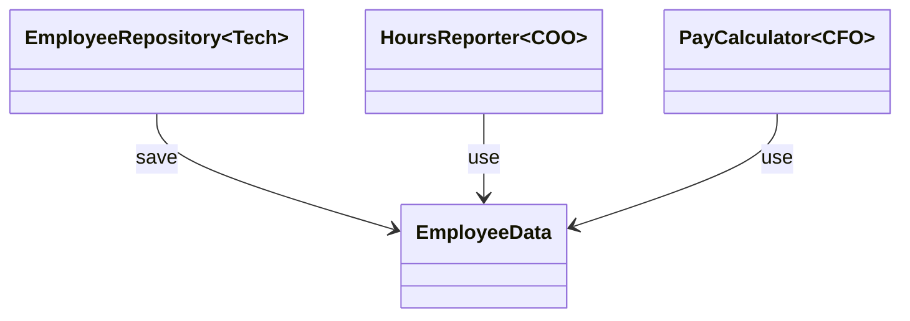

## はじめに

クラスは一つのことだけをすべき」――― 単一責任原則（Single Responsibility Principle、以下SRP）をこう理解している開発者は少なくない。しかし、この理解は原典の定義とは大きく異なる。

日本語コミュニティにおいて、「SRP」における「責任（Responsibility）」という言葉は、しばしば日常語の範疇で理解されてしまっている。

この混乱の原因はいくつかある。主には、英語で書かれた原典へのアクセス困難さと、原典あるいは原典への参照を明示した資料にあたらず、二次資料・三次資料を経由することで良しとしてしまう日本語コミュニティの風習にあるだろう。その結果として「SRP」の、とりわけ「責任（Responsibility）」の解釈が各自の想像に委ねられてしまい、「SRP」という同じ用語を用いているにもかかわらず、しばしば議論がかみ合わなくなってしまう。
場合によっては、日常語の延長線上とされてしまった「責任」を用いる「SRP」の説明を以て、「SRPは有名無実な原則だ」と批判されてしまう場合もある。これは、本来のSRPに対する適切な批判とは言い難いが、そのような批判を生み出してしまう土壌は現実にある。

例えば、SRPの「責任」について、以下のような独自の解釈が展開されている：

- 「ある関心事について、不正な動作にならないよう、正常に動作するよう制御する責任」[^1]
- 「再利用性を高めるための原則」として、一つのコンポーネントは一つの機能のみを持つべき[^2]

これらは、いずれも発案者Robert C. Martin（以下、Martin）の定義とは異なる軸での理解だ。

さらに複雑なことに、Martin自身がSRPの定義を変更している。『Agile Software Development, Principles, Patterns, and Practices』（2003年、以下ASD）、ブログ記事（2014年、以下Blog）、そして『Clean Architecture』（2017年、以下CA）では、定義が段階的に変化しているのだ。

本記事では、これら三つの資料を参照し、SRPの定義がどのように変化したのかを明らかにする。その上で、それぞれの定義の関係を批判的に分析し、実践での使い分けについて提案する。

[^1]: https://qiita.com/MinoDriven/items/76307b1b066467cbfd6a
[^2]: https://qiita.com/seya/items/8814e905693f00cdade2

## SRPの思想的ルーツ

SRPは突然現れた原則ではない。MartinはASDで既にその思想的背景を説明している。

> The principle was described in the work of Tom Demarco and Meilir Page-Jones. The called it cohesion. They defined cohesion as the functional relatedness of the elements of a module. In this chapter we'll shift that meaning a bit and relate cohesion to the forces that cause a module, or a class, to change[^3].
>
> この原則はトム・デマルコとメイリル・ページ＝ジョーンズの著作で説明された。彼らはこれを凝集度と呼んだ。彼らは、モジュールの要素間の機能的関連性として凝集度を定義した。本章ではその意味を少し変え、凝集度をモジュールやクラスに変化をもたらす力と関連づける。（以降、英文の翻訳は筆者による）

[^3]: Martin(2003) p.95

他、BlogでもMartinはその思想的背景に言及している。

> In 1972 David L. Parnas published a classic paper entitled On the Criteria To Be Used in Decomposing Systems into Modules.
> (...)
> Parnas’ conclusion was that modules should be separated based, at lease in part, on the way that they might change.
>
> Two years later, Edsger Dijkstra wrote another classic paper entitled On the role of scientific thought. in which he introduced the term: The Separation of Concerns.
>
> The 1970s and 1980s were a fertile time for principles of software architecture. Structured Programming and Design were all the rage. During that time the notions of Coupling and Cohesion were introduced by Larry Constantine, and amplified by Tom DeMarco, Meilir Page-Jones and many others.
>
>In the late 1990s I tried to consolidate these notions into a principle, which I called: The Single Responsibility Principle. (I have this vague feeling that I stole the name of this principle from Bertrand Meyer, but I have not been able to confirm that.)[^4]
>
> 1972年、デイビッド・L・パーナスは『システムをモジュールに分解する際に用いるべき基準について』と題する古典的論文を発表した。
> (...)
> パーナスの結論は、モジュールは少なくとも部分的には、それらがどのように変化する可能性があるかに基づいて分離されるべきだというものだった。
>
> 2年後、エドガー・ダイクストラは『科学的思考の役割について』と題する別の古典的論文を執筆し、その中で「関心の分離」という概念を導入した。
>
> 1970年代から1980年代にかけては、ソフトウェアアーキテクチャの原則が活発に発展した時代であった。構造化プログラミング・設計が流行していた。この時期に結合度と凝集度の概念がラリー・コンスタンティンによって提唱され、トム・デマルコ、メイリル・ページ＝ジョーンズらによってさらに発展が図られた。
>
> 1990年代後半、私はこれらの概念をひとつの原則に統合しようと試みた。私はこれを単一責任の原則と呼んだ（この原則の名称をバートランド・マイヤーから拝借したような漠然とした記憶があるが、確認はできていない）。

[^4]: Martin(2014)

このように、SRPはパーナスに端を発し、ダイクストラ、デマルコ、コンスタンティン、ジョーンズらによって洗練されてきたモジュール分割の理論を統合したものである。

## SRP v1：「変更の理由」による定義（ASD, 2003）

### 定義

ASDにおけるSRPの定義は以下の通りだ：

> A class should have only one reason to change[^3].
>
> クラスは変更される理由を一つだけ持つべきである。

Martinはさらに、「責任」を次のように定義する：

> In the context of the SRP, we define a responsibility to be "a reason for change." If you can think of more than one motive for changing a class, then that class has more then one responsibility.[^5]
>
> SRPの文脈では、責任を「変更の理由」と定義する。あるクラスを変更する動機が複数思い浮かぶ場合、そのクラスは複数の責任を負っている。

[^5]: Martin(2003) p.97

### 問題の焦点と目的

v1の主目的は、**不要な依存関係と変更の波及を排除すること**だ。

ASDにおいてMartinは、大きく分けて「技術的効率の損失」と「設計の脆弱性」の2点を問題点として挙げている。

それらを説明するにあたり、Martinは以下のような`Rectangle`クラスを挙げている。これは、SRP違反の例である。[^6]

[^6]: Martin(2003) p.96


#### 問題：技術的効率の損失

- 不要なライブラリのリンク（コンパイル時間・リンク時間・メモリの浪費）
- 無関係な変更による再コンパイル・再テスト・再デプロイ

Martinは`Rectangle`クラスの例を挙げる。このクラスには、幾何学的計算（面積計算）と画面描画の二つのメソッドがある。

計算幾何学アプリケーションは`Rectangle`を数学的処理に使うが、画面描画はしない。しかし、この設計では以下の問題が発生する。

> This violation of the SRP causes several nasty problems. First, we must include the GUI in the computational geometry application. If this were a C++ application, the GUI would have to be linked in, consuming link time, compile time, and memory footprint. In a Java application, the .class files for the GUI have to be deployed to the target platform[^6].
>
> このSRP違反は複数の厄介な問題を引き起こる。第一に、計算幾何学アプリケーションにGUIを含める必要がある。C++アプリケーションの場合、GUIをリンクする必要があり、リンク時間・コンパイル時間・メモリ使用量を消費する。Javaアプリケーションでは、GUIの.classファイルをターゲットプラットフォームにデプロイしなければならない。

問題の本質は、「GUI技術の変更」という変更理由と、「幾何学的計算方式の変更」という変更理由が、一つのクラスに混在していることだ。

#### 問題：設計の脆弱性

- 責任の結合による予期せぬ副作用
- 一つの変更が他の責任を損なう可能性

Martinは、別チャプターで作成したボウリングゲームのアプリケーションで行った分割を例として、複数の責任の結合がもたらす本質的な問題を以下のように説明する。

> なぜこれら二つの責任を別々のクラスに分離することが重要だったのか？それぞれの責任が変更の軸となるからだ。(...)

> Why was it important to separate these two responsibilities into separate classes? Because each responsibility is an axis of change. When the requirements change, that change will be manifest through a change in responsibility amongst the classes. If a class assumes more than one responsibility, then there will be more than one reason for it to change.
> If a class has more than one responsibility, then the responsibilities become coupled. Changes to one responsibility may impair or inhibit the ability of the class to meet the others. This kind of coupling leads to fragile desings that break in unexpected ways when changed.[^6]
> 
> なぜこれら二つの責任を別々のクラスに分離することが重要だったのか？それぞれの責任が変更の軸となるからだ。要件が変更されると、その変更はクラス間の責任の変遷を通じて顕在化する。クラスが複数の責任を担う場合、変更の理由も複数存在する。
> クラスが複数の責任を持つと、それらの責任は結合される。一つの責任への変更が、他の責任を果たすクラスの能力を損なったり妨げたりする可能性がある。この種の結合は、変更時に予期せぬ形で壊れる脆弱な設計につながる。

Rectangleの例で言えば、GUIの変更が`Rectangle`クラスに変更を要求した場合、その変更が幾何学的計算に予期せぬ影響を与える可能性がある。

> Second, if a change to the `GraphicalAplication` causes the `Rectangle` to change for some reason, that change may force us to rebuild, retest, and redeploy the `ComputationalGeometryApplication`. If we forget to do this, that application may break in unpredictable ways.[^6]
>
> 第二に、`GraphicalApplication`の変更が何らかの理由で`Rectangle`に対する変更をもたらした場合、その変更により`ComputationalGeometryApplication`の再構築・再テスト・再デプロイが必要になる可能性がある。これを怠ると、アプリケーションが予測不能な形で動作しなくなる恐れがある。

Martinが「予測不能な形で動作しなくなる（behave unpredictably）」と述べているのは、単にテストやコンパイルの手間に閉じる問題ではない。一つの変更が、本来無関係であるべき別のモジュールに対して、開発者が予期しない形で影響を及ぼすことへの警告も含んでいる。

#### 目的：変更の影響範囲の限定

SRP v1の主目的は、**関係のない理由による変更から、クラスとそのクライアントを保護すること**だ。

それぞれのクラスで変更の理由が独立していれば、以下の効果が期待できる。

- 変更の影響範囲が限定される
- 不要な再コンパイル・再デプロイが避けられる
- 一つの責任への変更が、他の責任に予期せぬ影響を与えない

「バグ防止」や「変更容易性」は、この主目的の**帰結**として現れるものであり、主目的そのものではない。

### 適用の判断基準

重要なのは、Martinが「変更軸は、実際に変更が発生する場合にのみ変更軸となる」と述べていることだ。

`Modem`インターフェースの例で、Martinは接続管理（`dial`, `hangup`）とデータ通信（`send`, `recv`）の二つの責任を指摘する。
しかし、すぐに分離すべきかと問われれば、以下のように答えている。

> Should these two responsibilities be separated? That depends on how the application is changing[^5]. 
>
> これらの2つの責任は分離すべきでしょうか？それはアプリケーションがどのように変化するかによります。

この判断基準は重要だ。接続関数のシグネチャの変更が頻繁に発生し、その度にデータ通信を扱うクラスの再コンパイル・再デプロイが強いられるなら、分離すべき。しかし、そのような変更が発生しないなら、分離は「不必要な複雑性」を生むだけだ。

> An axis of change is an axis of change only if the changes actually occur. It is not wise to apply the SRP, or any other principle for that matter, if there is no symptom.[^5]
>
> 変更軸は、実際に変更が発生する場合にのみ変更軸となります。症状がないのにSRP（単一責任の原則）やその他の原則を適用するのは賢明ではありません。

ASDにおいて、SRPの「変更の理由」は実際に変更が発生してはじめて「変更の軸」となるのであって、その症状が発生していない内から適用するのは賢明でない（not wise）としている。

つまり、v1は**変更に発生した変更パターンに基づいて適用する**原則である。「あらかじめ適用しておく」という性質のものとしては、Martinにおいては捉えられていない。

## 転換点：「人々」への焦点（Blog, 2014）

### "This principle is about people"

2014年、Martinは自身のブログ「The Clean Code Blog」にて、SRPについて重要な記述を加えている

> And this gets to the crux of the Single Responsibility Principle. *This principle is about people*.[^4]"
>
> そしてこれが「単一責任原則」の核心になる。*この原則は、人々に関するものである*

この記事においておそらく初めて、MartinはSRPの「変更の理由」を、**人々**に明示的に結びつけた。

> When you write a software module, you want to make sure that when changes are requested, those changes can only originate from a single person, or rather, a single tightly coupled group of people representing a single narrowly defined business function.[^4]
>
> ソフトウェアモジュールを記述する際には、変更が要求された場合、その変更が単一の人物、あるいは単一の狭く定義された業務機能を代表する緊密に連携したグループからのみ発生することを明確にすべきだ。

2014年の時点で、SRPの焦点は技術的関心から**組織的関心**へと移行しつつあった。

### Employeeクラスの初出

この2014年のブログで、後にCA（2017）でも使われる`Employee`の例が登場する：

```java
public class Employee {
  public Money calculatePay();
  public void save();
  public String reportHours();
}
```

Martinは、CXOを題材に各メソッドを説明している。

- `calculatePay()`：CFOの組織が規定（財務責任）
- `reportHours()`：COOの組織が規定（運用責任）
- `save()`：CTOの組織が規定（技術責任）

つまり、現状の `Employee` クラスは、複数種類のCXO（が担う業務機能）に紐づく振る舞いを同時に保持しているということになる。すなわち、SRP違反の例だ。
この時点で「アクター（Actor）」という言葉は使われていないが、CXOというメタファによるクラス分割は、Blog(2014)時点で示唆されていた。

### SRPと凝集度・結合度

Martinはこの時点で、SRPを別の言葉でも表現している。

> Gather together the things that change for the same reasons. Separate those things that change for different reasons.
>
> 同じ理由で変化するものを集めよ。異なる理由で変化するものは分離せよ。

これは凝集度・結合度との関係を明示する表現だ。

ここで語られているのは、「何を集め、何を分離するか」ということについての指針である。すなわち、「分離」だけでなく「結合」もここでは重要な判断基準として示されている。
このことから、SRPを「一つのモジュールには一つの機能だけをもたせる」という原則として理解するのは、Martinの定義よりもやや狭い意味になっていると言える[^7]。

[^7]: これは憶測だが、UNIX哲学の「一つのことを上手くやる」との混同が生じているのかもしれない。

### 「変更の理由」は「人々」へ

> However, as you think about this principle, remember that the reasons for change are *people*. It is *people* who request changes.[^4]
>
> しかしながら、この原則について考えるときには、「変更の理由は*人々*である」ということを覚えておくこと。*人々*こそが変更を求めるのだ。

ブログでは、終盤でこのように強調している。v1ではやや抽象的に語られていた「変更の理由」が、「人々(people)」という表現によって、その方向性が定められつつある時期であると言えるだろう。

## SRP v2：「アクター」による定義（CA, 2017）

### 定義の明確化

CAにおいて、Martinは従来の表現が誤解を招いたことを認めた[^8]上で、新しい定義を提示している。

[^8]: Martin(2017) p.81 "SOLID原則のなかで最も誤解されがちなのが「単一責任の原則（SRP）」だろう。おそらくその原因は、名前があまりよくなかったことだ。"

> モジュールはたったひとつのアクターに対して責務を負うべきである。[^9]

[^9]: Martin(2017) p.82

ここで「アクター」とは、特定の一個人や一役職を指すものではなく、「変更を望む人たちをひとまとめにしたグループ」だ[^10]。2014年の「tightly coupled group of people representing a single narrowly defined business function」が、「アクター」という用語で整理された形だ。

[^10]: Martin(2017) p.82 "複数のユーザーやステークホルダーがシステムを同じように変更したいと考えることもある。ここでは、変更を望む人たちをひとまとめにしたグループとして扱いたい。このグループのことをアクターと呼ぶことにしよう。"

v1では「変更の理由」と、やや抽象的な定義だった「責任」が、「アクター」という言葉を用いることでより明確化されている。

### 問題の焦点：組織的結合

v2が扱う問題は、**異なるアクターのコードが同一モジュールに混在することによる結合**だ。Martinは2つの症例を提示している。

#### 症例1：想定外の重複（実行時の干渉）

2014年のブログで初出した`Employee`の例が、ここで詳細に展開される。CAでは、`calculatePay()`と`reportHours()`が両方とも`regularHours()`という共通メソッドを呼び出しているケースが提示されている。

CFOチームが所定労働時間の算出方法を変更したいとする。開発者が`regularHours()`を変更したが、それが`reportHours()`からも呼ばれていることに気づかなかった。
結果、間違ったデータを出力してしまい、何百万ドルもの損害が出たというシナリオがここの説明で用いられている。

> よく似たことは誰もが経験しているだろう。問題が起こった原因は、別々のアクターのコードをひとつにまとめてしまったことにある。単一責任の原則（SRP）は、アクターの異なるコードは分割するべきという原則だ。[^11]

[^11]: Martin(2017) p.82-84

これは**実行時の予期せぬ干渉**の問題である。一方のアクターへの変更が、共有コードを通じて他方のアクターに影響を及ぼす。

#### 症例2：マージの頻発（開発時の衝突）

CAでは、さらに別の問題も指摘されている：

> さまざまなメソッドが含まれるソースファイルでは、マージが頻繁に発生することもめずらしくない。個々のメソッドがそれぞれ別々のアクターに対応しているなら、なおさらそのような場面は多くなる。

具体例として、以下のシナリオが示される：

- DBAチーム（CTO配下）：データベースの`Employee`テーブルのスキーマを変更
- 人事チーム（COO配下）：勤怠報告の書式を変更
- 両者が同じ`Employee`クラスをチェックアウトして変更
- **マージが必要になる**

Martinは「マージのリスク」について以下のように述べる：

> マージのリスクについてはわざわざ説明する必要もないだろう。いまどきのツールならうまい具合にこなしてくれる。だが、どんな場面にも対応できる万能のツールなど存在しない。どうしてもリスクは残ってしまう。
> 今回のマージの例では、CTO とCOO の双方にリスクが残る。さらには、CFO まで巻き添えを食らう可能性も否定できない。
> その他にもさまざまな症例が考えられるが、いずれも複数の人たちがそれぞれ別の理由で、同じソースファイルを変更することに原因がある。改めて言うが、こうした問題を回避するには、アクターの異なるコードは分割するべきである。[^12]

**無関係なアクター（CFO）まで影響を受ける可能性がある**。これがv2が取り扱うもう一つの問題である。

[^12]: Martin(2017) p.84

#### v1とv2の対比：問題の性質の変化

ここまで見た内容から、v1（ASD）とv2（CA）で、取り扱う問題の性質は変化していると見るべきだろう。

| 観点 | v1（Rectangle例） | v2（Employee例） |
|------|------------------|-----------------|
| 結合の種類 | 技術的結合 | 組織的結合 |
| 問題の焦点 | GUI←→計算の技術的依存 | CFO←→COO←→CTOの組織的依存 |
| 主な症例 | 不要なリンク・再コンパイル、予期せぬ副作用 | 共有コードの干渉、マージの衝突 |
| 変更の起源 | 技術的決定（GUIライブラリ、アルゴリズム） | 組織的要求（部門ごとの業務要件） |

v1は「異なる技術的関心の分離」、v2は「異なる組織的関心の分離」を扱っている。

### 目的：アクター間の干渉の回避

ここまでの内容から、v2の主目的は、**異なるアクターの要求が互いに干渉しないようにすること**だと言える。

CAでは、技術的効率（コンパイル・デプロイ時間）への言及は**ほとんどない**。焦点は、組織構造とソフトウェア構造の対応関係に移っている。

### SRPの適用レベル

v1もv2も、どちらも**クラスレベル**を扱う原則である。

Martinは「モジュール」を「ソースファイル」と定義しつつ、より一般的には「いくつかの関数とデータをまとめた凝集性のあるもの」としている[^12]。これは、ソースファイル以外にコードを格納する言語（例：Ruby、Python）でのクラスに相当する概念だ。

CAの「まとめ」で、Martinは以下のように述べている：

> 単一責任の原則（SRP）は関数やクラスに関する原則だが、同じような原則が別のレベルでも登場する。コンポーネントレベルでは、この原則は「閉鎖性共通の原則（CCP）」と呼ばれるようになる。また、アーキテクチャレベルでは、「アーキテクチャの境界」を作るための「変更の軸」と呼ばれている。[^12]

つまり、SRP自体はクラスレベルの原則であり、より上位のレベル（コンポーネント、アーキテクチャ）には別の原則が存在する。v1とv2の違いは適用レベルではなく、**どのような観点から観察するか、の種類**にある。

[^12]: Martin(2017) p.85

## 批判的分析

v2（アクター）は組織的/業務的関心を扱うには強力だが、技術的関心の扱いには限界がある。以下、Martinのテキストを分析してこの主張を裏付ける。

### CAにおける技術的関心のアクター化

CAでは、`Employee`クラスの`save()`メソッドを「CTOアクター」に帰属させている。

> save() メソッドは、データベース管理者が規定する。報告先はCTO だ。[^13]

[^13]: Martin(2017) p.83

これは技術的関心（永続化）もv2の枠組みで扱おうとする試みだ。つまり、v2は組織的関心だけでなく、技術的関心も「アクター」という概念で統一的に扱おうとしているように見える。

### SRP v2は技術的関心を包括したか？

結論から言えば、本稿ではこの包括化には**失敗している**と評価する。以下、その理由を示す。

#### 理由1. 技術的分離の例でアクターが使われていない

Blog 2014で、Martinは技術的分離の重要性を述べている：

> This is the reason we do not put SQL in JSPs. This is the reason we do not generate HTML in the modules that compute results. This is the reason that business rules should not know the database schema. This is the reason we separate concerns.[^4]

注目すべきは、これらの分離を説明する際、**アクター概念を使っていない**点だ。

- 「SQLをJSPに入れない」は、どのアクター間の分離なのか？
- 「ビジネスルールがDBスキーマを知らない」は、誰と誰の責任分離なのか？

Martinはこれらの技術的分離について、「we separate concerns」と述べ、むしろ古典的な**関心の分離（Separation of Concerns）**に言及している。アクター概念でこれらを説明していない。

#### 理由2. DBAは「業務機能を代表する」か

Blog 2014でのアクターの定義を再確認する。

> a single tightly coupled group of people representing a single narrowly defined business function[^4]
>
> 単一の狭く定義された業務機能を代表する、緊密に連携した人々のグループ

この定義に照らして、DBAやCTOは「業務機能を代表する」のだろうか。

CFOは財務という業務機能を代表する。COOは人事・運用という業務機能を代表する。一方、CTOが担当するのは、特定の業務領域というよりは、技術インフラである。

つまり、CTOやDBAは**業務機能**というよりは、**技術的決定**を担当する。給与計算や勤怠管理といった「業務」ではなく、データベース技術の選定やスキーマ設計といった「技術」を扱う。

好意的に解釈するなら、そうした「技術的決定」それ自体がCTOやDBAの「業務機能」であるとみなせれば、まだ整合の余地はあるかもしれない。しかし既に見た通り、MartinはCAで「`save()`メソッドはDB管理者が規定する」と言及している。つまり、CTO/DBAには「データ管理」といった業務機能が既に割り当てられているため、このように解釈するのも難しい。

これは、BlogおよびCAで定義された「業務機能を代表する人々のグループ」と整合しない。

### 理由3. 永続層とアプリケーション層の分離

この問題をより明確に示すため、一般的な設計原則を考えよう。

ここでは、「永続層（データアクセス）とアプリケーション層（ビジネスロジック）を分離せよ」という設計原則を扱う。

この分離をv2で説明しようとすると、以下の問題が生じる：

- 永続層は「CTOアクター」に属するのか？
- しかし、永続化は**すべてのアクター**（CFO、COO、顧客など）が必要とする横断的関心である
- 「モジュールはたったひとつのアクターに対して責務を負うべき」という定義に合わない

v1なら、以下の通り自然に説明することができる。

- 変更理由1：ビジネスロジックの変更（業務要件の変化）
- 変更理由2：DB技術の変更（PostgreSQL→MongoDB、ORMの変更など）
- これらは独立した変更理由なので分離すべき

永続化技術の変更は、**どの業務機能からも独立**して発生しうる。これは「アクターからの要求」として表現するのが不自然だ。

### 理由4. アクター同一性の循環

もう一つの問題がある。v2におけるアクター定義自体に**循環**がある。

CAでの定義（p.82）：

> 変更を望む人たちをひとまとめにしたグループ

この定義は以下の循環を含む：

1. 何が「同じグループ」を構成するか？ → 「同じ変更を望む」人々
2. 何が「同じ変更」か？ → 「同じアクターに属する」変更
3. 何が「同じアクター」か？ → 「同じ変更を望む人々のグループ」（1.に戻る）

実践では、この循環を**組織構造**（部門、役職）で解消するしかない。「経理部門」「人事部門」「技術部門」という組織上のグループをアクターとして扱う。

しかし、組織構造を使うと以下の問題が生じる：

1. **同じ部門でも、異なる変更理由がある**
   - 例：経理部門内の給与計算チームと税務計算チーム
   - これらは同じアクターなのか、別のアクターなのか？
2. **異なる部門でも、同じ変更理由がある**
   - 例：複数部門が使う共通の日付フォーマット
   - これは誰のアクターに属するのか？
3. **技術的関心は組織構造に対応しない**
   - 「永続層とアプリケーション層の分離」は、どの部門の要求なのか？
   - 「GUIライブラリの変更」を要求するアクターは誰なのか？

### 結論

ここまでの議論を総合する。

1. CAは技術的関心をアクター化しようとしている（`save()`→CTO）
2. しかし[Blog, 2014]では技術的分離の説明でアクターを使わず、「関心の分離」に言及している
3. アクターの定義（「業務機能を代表する」）は技術的関心に不適合
4. アクターの同一性条件が循環的で、組織構造に頼るしかない

しかし、永続層の分離、UI層の分離、技術スタックの変更といった技術的関心を「アクター」として表現するのは不自然だ。これらの変更理由は、特定の人々のグループではなく、技術的決定、アーキテクチャ上の制約、関心の分離といった設計原則から生じる。

**v2は組織的/業務的関心には有効だが、技術的関心の扱いには限界がある。**

このことから、SRPを実践において活用するならば、v2のみならずv1の観点も併用することが有効だと考える。

## 関心の種類によるv1・v2使い分け

### 定式化

前セクションの分析を踏まえ、本記事では以下を提案する。

**v1とv2は、同じクラスレベルで、異なる種類の関心に対して使い分けられるべきである**

具体的には、以下のような使い分けを想定している。

- **組織的関心**：v2（アクター）を適用し、異なる業務機能を代表するアクター間を分離
- **技術的関心**：v1（変更の理由）を適用し、異なる技術的変更理由を持つコードを分離

同一のクラス設計において、**どちらの観点で分割するか**、あるいは**どの順序で分割するか**を判断する。

### 使い分けの理由

#### 理由1：v1とv2で扱う関心の種類が異なる

| 観点 | v1（変更の理由） | v2（アクター） |
|------|-----------------|---------------|
| 主な問題 | 技術的結合 | 組織的結合 |
| 主な例 | Rectangle、Modem | Employee |
| 変更の起源 | 技術的決定（ライブラリ、アルゴリズム） | 組織的要求（部門の業務要件） |
| 判断基準 | 技術的変更パターン | 業務機能を代表するグループ |

この差異は、両者が**異なる種類の関心を扱っている**ことを示す。

#### 理由2：v2は技術的関心の扱いに限界がある

前セクションで示したように、v2は組織的関心（部門間の独立性）には強力だ。しかし、技術的関心（レイヤー分離、技術スタック）の説明には、「アクター」という概念では不適合なケースが発生する。Martinも技術的分離の説明ではアクターを使わず、「関心の分離」による分割を用いている。

これらの点から、技術的関心・決定についてはv2では扱いきれず、v1での補完が必要であると考える。

#### 理由3：概念の焦点の違い

- **v1での「責任」：**
   - 定義：「a reason for change」（変更の理由）
   - 抽象的で、技術的変更も組織的変更も含む
   - 例：「GUI技術の変更」「ビジネスルールの変更」

- **v2での「責任」：**
   - 定義：「アクターに対する責務」
   - Blog 2014で「responds to」（応答する）と言い換え
   - 具体的で、組織的関係（人々との関係）に焦点
   - 「業務機能を代表する人々のグループ」に限定

この焦点の違いから、以下のような使い分けを提案する。

- **「この変更は誰（どのアクター）が要求するのか？」** → v2で考える
- **「この変更はなぜ（どんな技術的理由で）起こるのか？」** → v1で考える

### 使い分けの具体例

同じ`Employee`クラスに対して、v1とv2を**同時に**適用する。

#### v2による分離（組織的関心）
- `calculatePay()`（CFOアクター）
- `reportHours()`（COOアクター）
- → 異なるアクターなので分離

#### v1による分離（技術的関心）
- ビジネスロジック（給与計算、勤怠報告）
- `save()`（永続化）
- → 異なる技術的変更理由なので分離

結果として、以下のようなクラス構造になる。最終的な構造はCAの例と同じだが、永続化の分離理由が異なっている。

[^14]: Martin(2017) p.85

- `PayCalculator`（CFOアクター、ビジネスロジック）
- `HoursReporter`（COOアクター、ビジネスロジック）
- `EmployeeRepository`（永続化、技術的関心）
- `EmployeeData`（データ構造）



### 代替解釈の検討

以下の代替解釈も検討に値する：

### 代替A：v2の拡張

- v2の「アクター」を拡張し、技術的関心も包含する
- 「技術アクター」（DBA、インフラチーム）も正当なアクターとして扱う

懸念点： Blogでのアクター定義「業務機能を代表する人々のグループ」と矛盾する。永続化技術の変更は、すべてのアクター（CFO、COO、顧客など）が必要とする横断的関心であり、特定のアクターに帰属させるのは不自然。

### 代替B：v1の再解釈

- v1の「変更の理由」に組織的理由も含める
- v1だけで両方の関心を扱う

懸念点： v1（ASD）では組織的関心の例がほとんどなく、技術的例が中心。v2の「アクター」概念は、組織的関心を扱うための明示的な拡張と解釈すべき。

### 代替C：完全置き換え**

- v2がv1を完全に置き換えた
- 技術的関心も「技術部門というアクター」で扱うべき

懸念点： Martinが技術的分離の説明でアクターを使わず「関心の分離」に言及している（Blog:62）点と矛盾する。

## 本稿の限界について

本稿で提案した「v1を技術的関心の分離に、v2を組織的関心の分離に用いる」という方法について、以下の点に注意する必要がある。

#### 注意点1：Martinの意図とは独立である

- Martinがこの使い分けを意図していたかは不明
- これはテキスト分析に基づく筆者の解釈
- Martin自身がこの解釈を支持するとは限らない

#### 注意点2：実践的検証は限定的

- 本記事では理論的分析のみ
- 実際のプロジェクトでの長期的な有効性は未検証
- より多様なドメインでの検証が必要

## 実践的指針

### クラス設計における判断フロー

クラス分割を検討する際、以下の順序で判断する。

- ステップ1：変更の起源を特定
   - この変更は誰が要求するのか？
   - 特定の業務機能を代表するグループか？
   - 技術的決定か？
- ステップ2：適切な定義を選択
   - 業務機能を代表するグループ → v2（アクター）
   - 技術的決定やアーキテクチャ上の制約 → v1（変更の理由）
- ステップ3：分離の判断
   - v2の場合：異なるアクターか？ → 分離
   - v1の場合：異なる技術的変更理由か？ → 分離（ただし症状がある場合のみ）

### 具体的な判断例

| ケース | 判断 | 理由 |
|--------|------|------|
| 給与計算 vs 勤怠報告 | v2で分離 | 異なるアクター（CFO vs COO） |
| ビジネスロジック vs 永続化 | v1で分離 | 異なる技術的変更理由 |
| GUI描画 vs 幾何学計算 | v1で分離 | 異なる技術的変更理由 |
| 経理部門 vs 営業部門の要求 | v2で分離 | 異なるアクター |

### 注意点

- **v1とv2は排他的ではない**
   - 同じクラスに対して両方を適用可能
   - 組織的分離と技術的分離を同時に行う
- **上位レベルには別の原則**
   - パッケージ/コンポーネントレベル：CCP（閉鎖性共通の原則）
   - アーキテクチャレベル：アーキテクチャの境界
   - SRPをパッケージ分離に誤用しない
- **症状に基づく適用**
   - 実際に変更が発生してから適用
   - 予防的な過度な分離は「不必要な複雑性」を生む
- **明確な組織構造（v2）：**
   - v2は組織構造が明確な場合に有効
   - アクターの同一性が曖昧な場合は、v1で判断

## まとめ

本記事では、SRPの定義の変遷を追い、v1（変更の理由）とv2（アクター）の関係を分析した。

### 主要な発見

1. **定義の変化**
   - ASD（2003）：「クラスは変更される理由を一つだけ持つべき」
   - Blog（2014）：「この原則は人々に関するもの」
   - CA（2017）：「モジュールはたったひとつのアクターに対して責務を負うべき」
2. **問題の焦点の変化**
   - v1：技術的結合による効率損失と脆弱性
   - v2：組織的結合によるアクター間の干渉
3. **v2の限界**
   - v2は組織的関心には強力だが、技術的関心の扱いに限界
   - 永続層分離、技術スタック変更などは「アクター」として表現しづらい

### 実践的提案

- **v1とv2を同じクラスレベルで使い分ける：**
   - 組織的関心（業務機能の分離） → v2（アクター）
   - 技術的関心（レイヤー分離など） → v1（変更の理由）
- **判断基準：**
   - 「誰が変更を要求するのか？」 → v2
   - 「なぜ（技術的理由で）変更が起こるのか？」 → v1

### 今後の課題

本記事の分析には限界がある。

- Martinの意図との整合性は未確認
- 実践的検証は限定的
- 代替解釈の可能性

しかし、SRPの「責任」を日常語の延長で理解するのではなく、Martinの原典に基づいて理解することの重要性は明らかだ。v1とv2の違いを認識し、適切に使い分けることで、より効果的なクラス設計が可能になる。

## 参考文献

- Robert C. Martin（2003）『Agile Software Development, Principles, Patterns, and Practices』(Pearson Education)
- Robert C. Martin（2014）『The Single Responsibility Principle』 (The Clean Code Blog)  2025-12-25 0:59閲覧
  - <https://blog.cleancoder.com/uncle-bob/2014/05/08/SingleReponsibilityPrinciple.html>
- Robert C. Martin（2017）『クリーンアーキテクチャ 達人に学ぶソフトウェアの構造と設計』(アスキードワンゴ)

